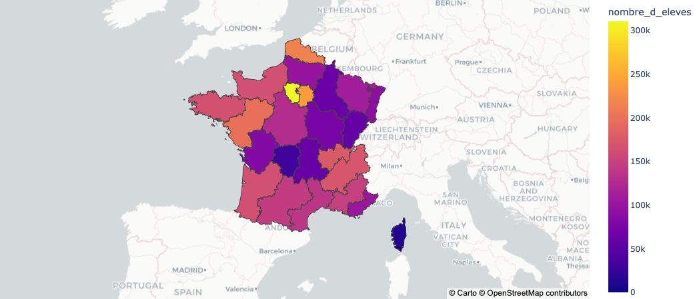
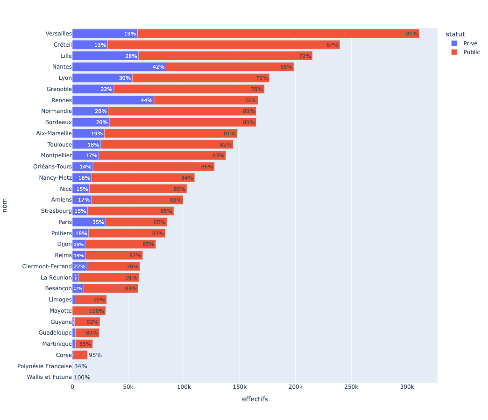

# La carte Scolaire - School affiliation map
 

## Introduction
Project which concluded 3 months training with python. 

The main goal was to collect, clean and transform data in order to produce statistical visual tool. This project was made in two weeks and there is still a lot of work to improve : see above
We worked around the School map in France. The issue was about middle school affiliation regarding your home adress. It is an administrative and educationnal stress or the parents. 

## What type of analyse could we do
We were able to acknowledge the middle school students in France  
  

Evaluate the proportion of student in private or public middle schools  
  

## What does it show
For this project, we worked with GEO JSON files to be able to represent France regions delimitation and target a living area. The user chooses a university area, chooses a school and have informations about it :
* Middle school name
* Number of students
* Success ratio
* IPS (indice de position sociale) : gives an indeication about family context influencing on education
* List of streets affiliated to this school

## What to improve next
* automatically show school when clicking ang zooming on an academic area
* Hide the list of adresses when it is too long and scroll down to see the rest
* showing street numbers affiliated to each area
* search bar for an adress to directly show the middle school affiliated
